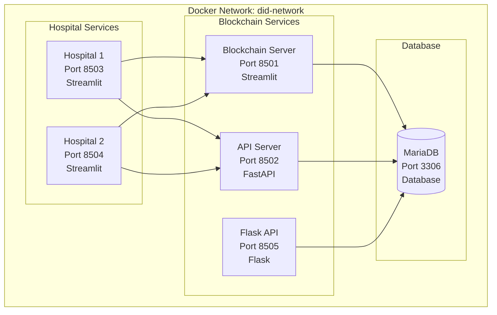

# 🏥 DID Blockchain Medical Records System

Sistem demonstrasi Decentralized Identity (DID) untuk rekam medis elektronik menggunakan blockchain dengan dukungan Docker containerization.

[](https://www.docker.com/)
[](https://www.python.org/)
[](https://streamlit.io/)
[](https://mariadb.org/)

## 🏗️ Arsitektur Sistem

Sistem ini terdiri dari 6 komponen utama yang berjalan dalam Docker containers:

1. **Blockchain Server** (Port 8501) - Streamlit app untuk memvisualisasikan blockchain
2. **API Server** (Port 8502) - FastAPI server untuk REST API
3. **Flask API** (Port 8505) - Flask server untuk VIC verification
4. **Hospital 1** (Port 8503) - Website rumah sakit pertama
5. **Hospital 2** (Port 8504) - Website rumah sakit kedua
6. **MariaDB Database** (Port 3306) - Database untuk menyimpan data blockchain

## 🚀 Cara Menjalankan

### Prerequisites
- Docker (versi 20.10+)
- Docker Compose (versi 2.0+)

### Quick Start dengan Docker

1. **Clone repository**
```bash
git clone https://github.com/Nvl123/simulasi-did-rekam-medis-elektronik.git
cd simulasi-did-rekam-medis-elektronik
```

2. **Jalankan semua service dengan Docker Compose**
```bash
# Menggunakan script start.sh (recommended)
chmod +x start.sh
./start.sh

# Atau langsung dengan docker-compose
docker-compose up --build -d
```

3. **Akses aplikasi**
- 🔗 **Blockchain Explorer**: http://localhost:8501
- 🏥 **Hospital 1**: http://localhost:8503
- 🏥 **Hospital 2**: http://localhost:8504
- 🔌 **API Server**: http://localhost:8502
- 🔌 **Flask API**: http://localhost:8505

### Docker Commands

```bash
# Start semua services
docker-compose up -d

# Stop semua services
docker-compose down

# Stop dan hapus volumes (reset data)
docker-compose down -v

# Lihat logs
docker-compose logs -f

# Rebuild dan restart
docker-compose up --build -d
```

## 🐳 Docker Architecture



### Container Details

| Service | Container Name | Port | Technology | Purpose |
|---------|----------------|------|------------|---------|
| Blockchain Server | `did-blockchain-server` | 8501 | Streamlit | Blockchain visualization & mining |
| API Server | `did-api-server` | 8502 | FastAPI | REST API for blockchain operations |
| Flask API | `did-flask-api` | 8505 | Flask | VIC verification endpoints |
| Hospital 1 | `did-hospital1` | 8503 | Streamlit | Hospital 1 VIC issuance |
| Hospital 2 | `did-hospital2` | 8504 | Streamlit | Hospital 2 VIC issuance |
| MariaDB | `did-mariadb` | 3306 | MariaDB | Database storage |

## 🔧 Fitur Utama

### Blockchain Server (Streamlit)
- Visualisasi blockchain real-time
- Mining transaksi
- Issue VIC (Verifiable Identity Credential)
- Analytics dan statistik
- Pencarian rekam medis pasien

### Website Rumah Sakit
- Interface untuk mengeluarkan VIC
- Form input data medis
- Generate QR Code untuk e-wallet
- Integrasi dengan blockchain

## 📱 Workflow Sistem

1. **Pasien datang ke rumah sakit**
2. **Dokter mengisi form VIC** di website rumah sakit
3. **Sistem mengeluarkan VIC** ke blockchain
4. **QR Code dihasilkan** untuk akses via e-wallet
5. **Blockchain mencatat transaksi** secara permanen
6. **Pasien dapat mengakses** rekam medis melalui e-wallet

## 🔗 API Endpoints

### Blockchain Server
- `GET /` - Dashboard blockchain
- `POST /api/issue-vic` - Issue VIC ke blockchain
- `GET /api/patient/{patient_id}` - Cari rekam medis pasien

## 🛠️ Teknologi yang Digunakan

- **Frontend**: HTML, CSS, JavaScript, Bootstrap
- **Backend**: Python, Streamlit
- **Blockchain**: Custom blockchain implementation
- **Containerization**: Docker, Docker Compose
- **Web Server**: Nginx

## 📊 Monitoring

Semua service memiliki health check yang akan memantau status:
- Blockchain server: `http://localhost:8501/_stcore/health`
- Hospital websites: `http://localhost:8081` dan `http://localhost:8082`

## 🔒 Keamanan

- Semua transaksi dienkripsi dengan SHA-256
- Blockchain immutable dan terdesentralisasi
- QR Code berisi hash transaksi untuk verifikasi

## 📝 Demo Scenario

1. Buka **Rumah Sakit A** (http://localhost:8081/vic-issuance.html)
2. Isi form dengan data pasien
3. Klik "Issue VIC to Blockchain"
4. Buka **Blockchain Explorer** (http://localhost:8501)
5. Lihat transaksi di tab "Pending Transactions"
6. Klik "Mine Pending Transactions"
7. Lihat transaksi di blockchain
8. Ulangi dengan **Rumah Sakit B**

## 🐛 Troubleshooting

### Service tidak bisa start
```bash
docker-compose down
docker-compose up --build
```

### Port sudah digunakan
```bash
# Cek port yang digunakan
netstat -tulpn | grep :8501
netstat -tulpn | grep :8081
netstat -tulpn | grep :8082

# Stop service yang menggunakan port
sudo kill -9 <PID>
```

### Reset semua data
```bash
docker-compose down -v
docker system prune -af
docker-compose up --build
```

## 📞 Support

Untuk pertanyaan atau masalah, silakan buka issue di repository ini.

---

**DID Blockchain Medical Records System**  
*Demonstrasi Decentralized Identity untuk Rekam Medis Elektronik*
