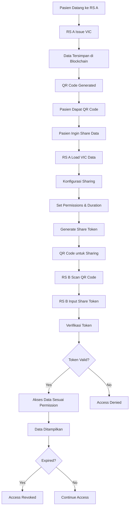

# 📋 Panduan Dokumentasi VIC Sharing System

## 🏥 Tentang Aplikasi

Aplikasi VIC (Verifiable Identity Credential) Sharing System adalah sistem berbasis blockchain yang memungkinkan rumah sakit untuk:
- Menerbitkan kredensial medis digital (VIC) untuk pasien
- Membagikan data medis pasien dengan rumah sakit lain secara aman
- Mengontrol akses data dan jangka waktu sharing
- Memverifikasi keaslian data medis menggunakan blockchain

## 🚀 Fitur Utama

### 1. Issue VIC (Penerbitan Kredensial)
- Membuat kredensial medis digital untuk pasien
- Menyimpan data ke blockchain
- Menghasilkan QR code untuk akses data

### 2. VIC Sharing (Berbagi Data)
- Membuat token sharing untuk data medis
- Mengontrol data apa saja yang dapat diakses
- Menentukan jangka waktu akses
- Membatasi akses ke rumah sakit tertentu

## 📊 Diagram Alur VIC Sharing



## 📖 Panduan Penggunaan

### Bagian 1: Mengakses Aplikasi

1. **Buka Aplikasi**
   - Akses aplikasi melalui browser
   - URL: `http://[server-address]:8501`
   - Aplikasi akan menampilkan halaman utama dengan dua tab utama

2. **Navigasi Interface**
   - **Tab "📋 Issue VIC"**: Untuk menerbitkan kredensial medis baru
   - **Tab "🔗 VIC Sharing"**: Untuk mengelola sharing data medis

### Bagian 2: Issue VIC (Penerbitan Kredensial)

#### Langkah-langkah:

1. **Isi Data Pasien**
   ```
   - Patient ID*: ID unik pasien (contoh: P001)
   - Patient Name*: Nama lengkap pasien
   - Diagnosis*: Diagnosis medis
   - Treatment*: Perawatan yang diberikan
   - Doctor*: Nama dokter yang menangani
   - Date: Tanggal perawatan
   - Additional Notes: Catatan tambahan (opsional)
   ```

2. **Submit Data**
   - Klik tombol "🔗 Issue VIC to Blockchain"
   - Sistem akan memproses dan menyimpan ke blockchain
   - QR code akan ditampilkan untuk akses data

3. **Hasil Penerbitan**
   - Transaction Hash: ID transaksi blockchain
   - Block Number: Nomor blok blockchain
   - QR Code: Untuk akses data melalui e-wallet

### Bagian 3: VIC Sharing (Berbagi Data Medis)

#### A. Mengakses Data yang Sudah Di-share

1. **Buka Tab "🔗 VIC Sharing"**
2. **Pilih Sub-tab "🔍 Access Shared VIC"**
3. **Masukkan VIC Share Token**
   - Token dimulai dengan "VIC_"
   - Diberikan oleh pasien atau rumah sakit lain
4. **Klik "🔍 Access VIC Data"**
5. **Lihat data medis sesuai permission yang diberikan**

#### B. Membuat VIC Share Baru

1. **Pilih Sub-tab "📤 Create VIC Share"**
2. **Load Data VIC**
   - Masukkan Transaction Hash (dimulai dengan "0x")
   - Klik "🔍 Load VIC Data"
3. **Konfigurasi Sharing**

### Bagian 4: Konfigurasi Sharing Data

#### Data yang Dapat Di-share:

| Data | Deskripsi | Default |
|------|-----------|---------|
| **Diagnosis** | Diagnosis medis pasien | ✅ |
| **Treatment** | Perawatan yang diberikan | ✅ |
| **Doctor** | Nama dokter | ✅ |
| **Date** | Tanggal perawatan | ✅ |
| **Notes** | Catatan tambahan | ❌ |

#### Pengaturan Sharing:

1. **Shared By**
   - Nama yang membagikan data (default: "Patient")

2. **Expires in (hours)**
   - Jangka waktu akses (1-8760 jam)
   - Default: 24 jam
   - Maksimal: 1 tahun (8760 jam)

3. **Specific Hospital (optional)**
   - Batasi akses ke rumah sakit tertentu
   - Kosongkan untuk akses universal

4. **Access Permissions**
   - Pilih data mana yang dapat diakses
   - Centang untuk mengizinkan akses
   - Hapus centang untuk membatasi akses

#### Contoh Konfigurasi:

**Scenario 1: Sharing Lengkap untuk Konsultasi**
```
- Shared By: Dr. Smith
- Expires in: 72 hours
- Specific Hospital: Rumah Sakit B
- Access Permissions: All checked ✅
```

**Scenario 2: Sharing Terbatas untuk Verifikasi**
```
- Shared By: Patient
- Expires in: 2 hours
- Specific Hospital: (kosong)
- Access Permissions: Diagnosis ✅, Treatment ❌, Doctor ✅, Date ✅, Notes ❌
```

**Scenario 3: Sharing Jangka Panjang**
```
- Shared By: Hospital Admin
- Expires in: 720 hours (30 hari)
- Specific Hospital: Rumah Sakit C
- Access Permissions: All checked ✅
```

### Bagian 5: Hasil Sharing

Setelah membuat VIC share, Anda akan mendapatkan:

1. **Share Token**
   - Format: `VIC_[random_string]`
   - Dapat dibagikan ke rumah sakit lain
   - Dapat disalin ke clipboard

2. **QR Code**
   - Berisi informasi share token
   - Dapat dipindai untuk akses cepat
   - Mencakup informasi kedaluwarsa

3. **Expiration Info**
   - Tanggal dan waktu kedaluwarsa
   - Format: ISO 8601

## 🔐 Keamanan dan Privasi

### Fitur Keamanan:

1. **Blockchain Verification**
   - Semua data diverifikasi melalui blockchain
   - Tidak dapat dimanipulasi setelah disimpan

2. **Token-based Access**
   - Akses hanya dengan token yang valid
   - Token memiliki masa berlaku

3. **Permission Control**
   - Kontrol granular atas data yang dapat diakses
   - Dapat membatasi akses ke rumah sakit tertentu

4. **Time-limited Access**
   - Akses otomatis berakhir setelah waktu yang ditentukan
   - Tidak ada akses permanen tanpa izin

### Best Practices:

1. **Gunakan Jangka Waktu Sesuai Kebutuhan**
   - Konsultasi singkat: 2-24 jam
   - Rujukan pasien: 1-7 hari
   - Follow-up jangka panjang: 30-90 hari

2. **Batasi Data yang Di-share**
   - Hanya share data yang diperlukan
   - Hindari sharing catatan sensitif kecuali diperlukan

3. **Verifikasi Penerima**
   - Pastikan token dibagikan ke rumah sakit yang terpercaya
   - Gunakan "Specific Hospital" untuk kontrol tambahan

## 🛠️ Troubleshooting

### Masalah Umum:

#### 1. "Invalid share token format"
**Penyebab:** Token tidak dimulai dengan "VIC_"
**Solusi:** Pastikan menggunakan token yang benar dari sistem

#### 2. "VIC not found"
**Penyebab:** Transaction hash tidak valid atau data tidak ada
**Solusi:** 
- Periksa format transaction hash (harus dimulai dengan "0x")
- Pastikan VIC sudah diterbitkan sebelumnya

#### 3. "API Error"
**Penyebab:** Koneksi ke server bermasalah
**Solusi:**
- Periksa koneksi internet
- Coba lagi setelah beberapa saat
- Hubungi administrator sistem

#### 4. "Share token expired"
**Penyebab:** Token sudah melewati masa berlaku
**Solusi:** Minta token baru dari pembuat share

### Error Codes:

| Error Code | Deskripsi | Solusi |
|------------|-----------|---------|
| 400 | Bad Request | Periksa format input |
| 404 | Not Found | Data tidak ditemukan |
| 500 | Server Error | Hubungi administrator |

## 📞 Dukungan Teknis

### Informasi Kontak:
- **Email:** support@hospital-a.com
- **Phone:** +62-xxx-xxxx-xxxx
- **Hours:** 24/7

### Log dan Monitoring:
- Semua aktivitas sharing dicatat
- Log dapat diakses untuk audit
- Monitoring real-time untuk keamanan

## ❓ FAQ (Frequently Asked Questions)

### Q: Berapa lama token sharing berlaku?
**A:** Token sharing dapat dikonfigurasi dari 1 jam hingga 1 tahun (8760 jam). Default adalah 24 jam.

### Q: Apakah data dapat diakses setelah token expired?
**A:** Tidak. Setelah token expired, akses akan otomatis diblokir dan data tidak dapat diakses lagi.

### Q: Bagaimana cara memperpanjang akses sharing?
**A:** Saat ini tidak ada fitur perpanjangan otomatis. Anda perlu membuat token sharing baru dengan jangka waktu yang diinginkan.

### Q: Apakah data yang di-share dapat disimpan oleh rumah sakit penerima?
**A:** Data hanya dapat diakses melalui sistem VIC dan tidak dapat disimpan secara permanen oleh rumah sakit penerima.

### Q: Bagaimana jika share token hilang atau terhapus?
**A:** Share token tidak dapat dipulihkan. Anda perlu membuat token sharing baru dari data VIC asli.

### Q: Apakah ada limit jumlah sharing per VIC?
**A:** Tidak ada limit jumlah sharing. Satu VIC dapat dibuatkan multiple share token dengan konfigurasi berbeda.

### Q: Bagaimana cara memastikan keamanan data?
**A:** 
- Gunakan jangka waktu sesingkat mungkin
- Batasi akses ke rumah sakit tertentu jika memungkinkan
- Hanya share data yang benar-benar diperlukan
- Verifikasi identitas penerima token

## 🎯 Contoh Skenario Penggunaan

### Skenario 1: Konsultasi Darurat
**Situasi:** Pasien perlu konsultasi darurat di rumah sakit lain
**Konfigurasi:**
```
- Duration: 4 jam
- Hospital: Rumah Sakit B
- Permissions: All (Diagnosis, Treatment, Doctor, Date)
- Notes: Tidak di-share
```

### Skenario 2: Rujukan Pasien
**Situasi:** Pasien dirujuk ke spesialis di rumah sakit lain
**Konfigurasi:**
```
- Duration: 7 hari
- Hospital: Rumah Sakit C
- Permissions: All (Diagnosis, Treatment, Doctor, Date, Notes)
```

### Skenario 3: Verifikasi Data
**Situasi:** Rumah sakit perlu verifikasi data pasien untuk asuransi
**Konfigurasi:**
```
- Duration: 2 jam
- Hospital: (Kosong - universal access)
- Permissions: Diagnosis, Doctor, Date only
```

### Skenario 4: Follow-up Jangka Panjang
**Situasi:** Monitoring pasien kronis
**Konfigurasi:**
```
- Duration: 30 hari
- Hospital: Rumah Sakit D
- Permissions: All
```

## 🔧 Konfigurasi Lanjutan

### Environment Variables
```bash
# API Configuration
API_BASE_URL=http://did-api-server:8502
HOSPITAL_NAME=Rumah Sakit A

# Blockchain Configuration
BLOCKCHAIN_SERVER=http://blockchain-server:8501
API_SERVER=http://api-server:8502
```

### API Endpoints
```
POST /api/issue-vic - Issue new VIC
GET /api/vic-share/{token} - Access shared VIC
POST /api/vic-share/create - Create VIC share
GET /verify/{hash} - Verify VIC data
```

## 📊 Monitoring dan Analytics

### Logs yang Dicatat:
- VIC issuance events
- Share token creation
- Access attempts (successful/failed)
- Token expiration events
- Permission changes

### Metrics yang Dimonitor:
- Total VICs issued
- Active share tokens
- Access frequency
- Error rates
- Token expiration patterns

## 🔄 Update dan Maintenance

### Versi Saat Ini: 1.0.0
### Fitur Terbaru:
- QR code generation
- Time-based access control
- Hospital-specific sharing
- Granular permission control

### Planned Updates:
- Mobile app integration
- Advanced analytics
- Automated sharing workflows
- Integration with EMR systems

---

## 📝 Changelog

### Version 1.0.0 (Current)
- Initial release
- Basic VIC issuance
- VIC sharing functionality
- QR code support
- Permission-based access control
- Time-limited sharing

---

*Dokumentasi ini dibuat untuk memudahkan penggunaan sistem VIC Sharing. Untuk pertanyaan lebih lanjut, silakan hubungi tim dukungan teknis.*
